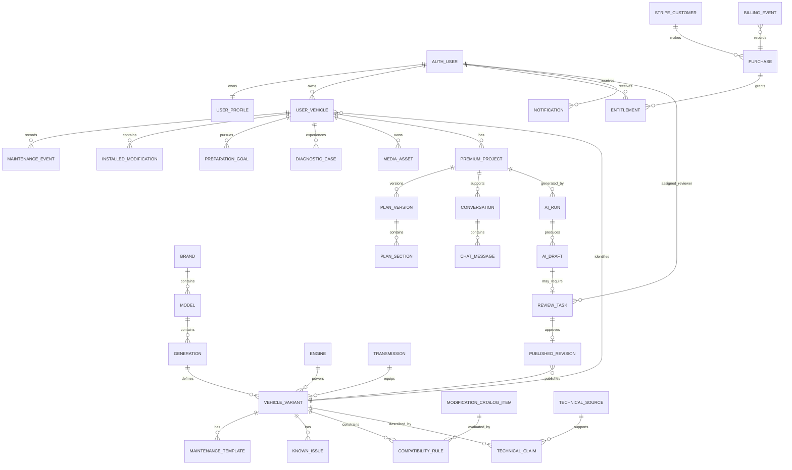
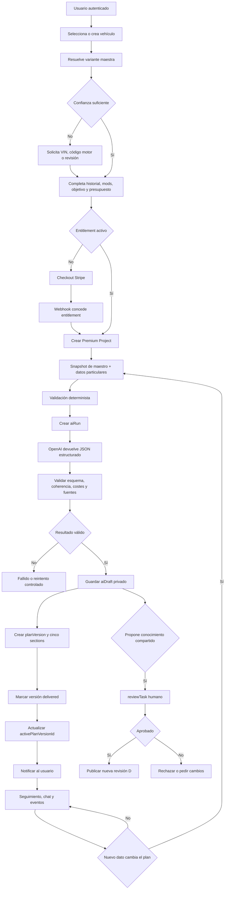

# Arquitectura técnica de Tuning Hub Premium

Estado: propuesta previa a implementación
Fecha: 2026-07-12
Alcance: datos, seguridad, servicios y flujo Premium. No define las pantallas finales.

## 1. Objetivo y principios

Tuning Hub Premium debe convertirse en un servicio persistente de acompañamiento para un vehículo concreto. El sistema debe conocer la variante de fábrica, el estado real del coche del usuario, su historial, objetivo, modificaciones y evolución, sin mezclar conocimiento compartido con información privada.

Principios obligatorios:

1. El conocimiento técnico compartido y los datos particulares del usuario son dominios diferentes.
2. Una salida de IA nunca se considera conocimiento publicado por el mero hecho de cumplir un esquema JSON.
3. El contenido Premium no se almacena en documentos de lectura pública.
4. La compra o suscripción se verifica en servidor y produce un entitlement persistente.
5. Cada afirmación técnica relevante debe conservar fuentes, grado de confianza y estado de revisión.
6. Los planes son versionados; una regeneración no sobrescribe el plan anterior.
7. Fotos, audios y diagnósticos pertenecen al usuario y son privados por defecto.
8. El backend de Render continúa siendo la frontera de confianza para OpenAI, Stripe y operaciones privilegiadas con Firebase Admin.

## 2. Situación actual que condiciona el diseño

La aplicación pública usa React/Vite y una navegación por `currentScreen` en `HomePage.jsx`. No tiene Firebase Auth. El dashboard THKB sí tiene Firebase Auth, Firestore y Storage. El backend Node actual vive en `server/app.mjs`, usa OpenAI Responses API, Firebase Admin y Stripe.

El prototipo Premium guarda perfil y plan en `localStorage`. El pago se recupera con `sessionStorage` y consulta de Stripe, pero no existen webhook, compras persistentes ni entitlements. La colección pública `builds` puede contener datos Premium. Esta propuesta reemplaza esos mecanismos para producción; no recomienda ampliarlos.

## 3. Clasificación obligatoria de los datos

### A. Datos maestros compartidos

Conocimiento editorial interno reutilizable entre propietarios de la misma versión:

- Marcas, modelos, generaciones y variantes.
- Motores y transmisiones.
- Especificaciones de fábrica.
- Plantillas de mantenimiento.
- Fallos conocidos.
- Catálogo de modificaciones.
- Compatibilidades e incompatibilidades.
- Reglas de homologación orientativas.
- Fuentes técnicas y afirmaciones respaldadas.

Estos datos pueden estar en edición, revisión o aprobados. No son públicos automáticamente.

### B. Datos particulares del usuario

Información privada y propiedad de una cuenta:

- Perfil del usuario y preferencias.
- Vehículos de su garaje.
- VIN, matrícula u otros identificadores privados.
- Kilometraje, estado e historial.
- Mantenimiento realizado y facturas.
- Modificaciones instaladas.
- Objetivos y presupuesto.
- Averías, síntomas y diagnósticos.
- Fotos, vídeos o audios.
- Proyecto Premium, progreso y decisiones.
- Conversaciones con el especialista IA.
- Notificaciones y preferencias.
- Compras y entitlements visibles para el propietario.

### C. Datos generados por IA no aprobados

Resultados provisionales, siempre separados del conocimiento publicado:

- Identificación inferida de variante.
- Planes Premium generados.
- Diagnósticos probables.
- Recomendaciones de mantenimiento o piezas.
- Resúmenes de medios.
- Respuestas candidatas para la base técnica.
- Nuevas compatibilidades o fallos propuestos.

Pueden mostrarse al propietario como recomendaciones personalizadas si se etiquetan correctamente, pero no deben alimentar las fichas maestras públicas sin revisión humana.

### D. Datos publicados y validados

Proyección pública, inmutable por clientes y derivada de revisiones aprobadas:

- Fichas públicas de variantes.
- Especificaciones verificadas.
- Mantenimiento general validado.
- Fallos conocidos validados.
- Compatibilidades publicadas.
- Fuentes y fecha de revisión.

La separación entre A y D debe ser física: el documento editorial completo no debe hacerse público mediante un simple campo `status`.

## 4. Diagrama lógico de entidades



## 5. Relaciones y responsabilidades

### Identidad técnica

- `brands/{brandId}` contiene una marca.
- `models/{modelId}` referencia `brandId`.
- `generations/{generationId}` referencia `modelId`.
- `vehicles/{variantId}` continúa como ficha maestra de una variante concreta y referencia `generationId`, `engineId` y `transmissionId`.
- `engines/{engineId}` representa un código o variante de motor, no un texto libre del formulario.
- `transmissions/{transmissionId}` representa una caja concreta, sus límites conocidos y variantes.

Se mantienen los nombres actuales para evitar crear otro catálogo paralelo. Las colecciones antiguas `catalog_*` deben migrarse o declararse legacy; no deben coexistir indefinidamente como dos fuentes de verdad.

### Vehículo del usuario

- `userVehicles/{userVehicleId}` pertenece a `ownerId` y referencia `variantId`.
- Puede tener `variantResolutionStatus` igual a `confirmed`, `probable` o `unresolved`.
- Los datos particulares nunca se escriben en `vehicles/{variantId}`.
- El VIN se guarda privado y no debe copiarse a logs, Analytics o prompts salvo necesidad técnica explícita.

### Proyecto Premium

- Un `userVehicle` puede tener varios proyectos históricos, pero solo uno activo por objetivo cuando el producto así lo limite.
- `premiumProjects/{projectId}` referencia propietario, vehículo, objetivo activo y entitlement.
- Cada generación crea `planVersions/{versionId}`.
- El proyecto apunta a `activePlanVersionId`; las versiones anteriores se conservan.
- Cada versión tiene cinco secciones predecibles: `vehicle`, `maintenance`, `modifications`, `issues` y `advisorSummary`.

### IA y revisión

- Toda ejecución genera un `aiRun` con modelo, esquema, hashes de contexto, coste/uso si está disponible, estado y errores.
- El contenido técnico candidato se guarda como `aiDraft`, nunca directamente en una colección pública.
- Una recomendación privada para el propietario puede pasar a `delivered` sin convertirse en conocimiento maestro.
- Una afirmación que pretenda enriquecer THKB necesita `reviewTask` y aprobación humana.
- La publicación crea una nueva `publishedRevision`; no muta silenciosamente una revisión ya citada.

## 6. Propuesta concreta de colecciones Firestore

### 6.1 Identidad, usuarios y configuración

#### `users/{uid}` — B

```js
{
  displayName,
  emailNormalized,
  locale: 'es-ES',
  timezone: 'Atlantic/Canary',
  status: 'active',
  onboardingCompleted,
  createdAt,
  updatedAt,
  lastSeenAt
}
```

No guardar roles administrativos editables por el usuario. Los roles efectivos deben proceder de custom claims; puede existir una copia informativa de solo servidor.

#### `users/{uid}/notificationPreferences/default` — B

```js
{
  inApp: true,
  email: true,
  maintenanceReminders: true,
  projectUpdates: true,
  advisorReplies: true,
  marketing: false,
  quietHours,
  updatedAt
}
```

### 6.2 Datos maestros editoriales — A

Se reutilizan y amplían las colecciones actuales:

- `brands/{brandId}`
- `models/{modelId}`
- `generations/{generationId}`
- `vehicles/{variantId}`
- `engines/{engineId}`
- `transmissions/{transmissionId}` — nueva
- `maintenance/{templateId}`
- `knownIssues/{issueId}`
- `modifications/{modificationId}`
- `compatibilities/{compatibilityId}`
- `rules/{ruleId}`
- `sources/{sourceId}`
- `technicalClaims/{claimId}` — nueva

Campos editoriales comunes:

```js
{
  editorialStatus: 'draft' | 'in_review' | 'approved' | 'archived',
  schemaVersion,
  confidence: {
    level: 'unverified' | 'low' | 'medium' | 'high' | 'verified',
    rationale,
    assessedBy,
    assessedAt
  },
  sourceIds: [],
  createdAt,
  createdBy,
  updatedAt,
  updatedBy
}
```

#### Motores

`engines/{engineId}` debe incluir código, familia, combustible, inducción, cilindrada, potencia/par por variante, mercados, años y límites documentados. Los límites fiables no se publican sin fuentes y contexto de uso.

#### Transmisiones

`transmissions/{transmissionId}`:

```js
{
  manufacturer,
  code,
  family,
  type: 'manual' | 'automatic' | 'dct' | 'cvt',
  gears,
  driveLayout,
  factoryTorqueRatingNm,
  knownIssues,
  serviceRequirements,
  compatibleVariantIds,
  sourceIds,
  editorialStatus,
  confidence
}
```

#### Fuentes y afirmaciones

`sources/{sourceId}` representa el documento, manual, catálogo o norma. `technicalClaims/{claimId}` representa una afirmación atómica:

```js
{
  entityType: 'vehicle' | 'engine' | 'transmission' | 'issue' | 'modification' | 'legalRule',
  entityId,
  fieldPath,
  value,
  sourceIds,
  confidence,
  reviewStatus,
  validFrom,
  validTo,
  market,
  notes
}
```

Esta separación permite justificar cada dato sin duplicar URLs en todos los documentos.

### 6.3 Proyección pública validada — D

- `publishedVehicleKnowledge/{variantId}`
- `publishedEngineKnowledge/{engineId}`
- `publishedModificationKnowledge/{modificationId}` si se necesita catálogo público.

Estas colecciones contienen únicamente los campos necesarios para lectura pública y una referencia a `publishedRevisionId`. Son escritas solo por backend después de una aprobación.

```js
{
  sourceEntityId,
  publishedRevisionId,
  locale,
  schemaVersion,
  identity,
  specifications,
  maintenanceSummary,
  knownIssueSummary,
  sourceSummary,
  reviewedAt,
  publishedAt
}
```

No incluir planes Premium, notas internas, prompts, datos de usuario ni borradores.

### 6.4 Garaje y estado particular — B

#### `userVehicles/{userVehicleId}`

```js
{
  ownerId,
  variantId,
  variantSnapshot,
  variantResolutionStatus,
  nickname,
  year,
  mileageKm,
  color,
  vinEncryptedOrProtected,
  registrationCountry,
  primaryUse,
  condition,
  currentGoalId,
  activeProjectId,
  profileCompleteness,
  createdAt,
  updatedAt,
  archivedAt
}
```

`variantSnapshot` conserva la identidad usada cuando se creó el proyecto, evitando que una corrección futura de la ficha maestra cambie retrospectivamente el contexto.

#### `userVehicles/{userVehicleId}/maintenanceHistory/{eventId}`

```js
{
  ownerId,
  type,
  title,
  performedAt,
  mileageKm,
  workshop,
  costEuro,
  parts,
  notes,
  sourceMediaIds,
  verificationStatus,
  createdAt,
  updatedAt
}
```

#### `userVehicles/{userVehicleId}/installedModifications/{installationId}`

```js
{
  ownerId,
  modificationId,
  customName,
  manufacturer,
  partNumber,
  installedAt,
  mileageKm,
  installedBy,
  costEuro,
  tuneRequired,
  tuneDetails,
  homologationStatus,
  documentMediaIds,
  compatibilityStatus,
  confidence,
  active,
  createdAt,
  updatedAt
}
```

#### `userVehicles/{userVehicleId}/goals/{goalId}`

```js
{
  ownerId,
  type: 'reliability' | 'street_performance' | 'aesthetic' | 'track' | 'custom',
  title,
  targetPowerCv,
  targetTorqueNm,
  budgetEuro,
  targetDate,
  usageConstraints,
  comfortPriority,
  legalRoadUseRequired,
  status,
  createdAt,
  updatedAt
}
```

Solo usar cifras objetivo cuando sean coherentes con la variante o estén etiquetadas como aspiración pendiente de evaluación.

#### `userVehicles/{userVehicleId}/diagnosticCases/{caseId}`

```js
{
  ownerId,
  title,
  symptoms,
  severityDeclared,
  startedAt,
  mileageKm,
  status: 'open' | 'monitoring' | 'resolved' | 'workshop_required',
  mediaIds,
  obdCodes,
  observations,
  aiAssessmentId,
  professionalAssessment,
  resolution,
  createdAt,
  updatedAt
}
```

La IA propone hipótesis, no un diagnóstico confirmado. `professionalAssessment` solo debe marcarse verificado con origen identificable.

### 6.5 Premium, suscripciones y pagos — B

#### `stripeCustomers/{uid}` — solo servidor

```js
{
  stripeCustomerId,
  emailHash,
  createdAt,
  updatedAt
}
```

#### `purchases/{purchaseId}` — solo servidor, lectura del propietario

```js
{
  userId,
  stripeCustomerId,
  stripeCheckoutSessionId,
  stripePaymentIntentId,
  stripeSubscriptionId,
  productCode,
  billingMode: 'one_time' | 'subscription',
  amount,
  currency,
  status,
  projectId,
  createdAt,
  paidAt,
  refundedAt
}
```

#### `entitlements/{entitlementId}` — solo servidor, lectura del propietario

```js
{
  userId,
  type: 'premium_project' | 'premium_subscription' | 'extra_build',
  scope: { projectId, userVehicleId },
  sourcePurchaseId,
  status: 'active' | 'expired' | 'revoked' | 'pending',
  startsAt,
  expiresAt,
  usageLimits,
  usageCounters,
  createdAt,
  updatedAt
}
```

El modelo permite mantener el pago único actual y añadir una suscripción sin rediseñar el acceso.

#### `billingEvents/{stripeEventId}` — solo servidor

Documento idempotente por ID de evento Stripe. Conserva tipo, fecha, resultado de procesamiento y referencias, no el payload completo indefinidamente salvo necesidad legal.

#### `premiumProjects/{projectId}`

```js
{
  ownerId,
  userVehicleId,
  goalId,
  entitlementId,
  status: 'onboarding' | 'generating' | 'active' | 'paused' | 'completed' | 'archived',
  activePlanVersionId,
  currentPhaseId,
  nextAction,
  progress,
  contextVersion,
  createdAt,
  updatedAt
}
```

#### `premiumProjects/{projectId}/planVersions/{versionId}`

```js
{
  ownerId,
  versionNumber,
  status: 'generating' | 'draft' | 'delivered' | 'superseded' | 'failed',
  generatedBy: 'ai' | 'human' | 'hybrid',
  aiRunId,
  inputSnapshot,
  summary,
  confidenceSummary,
  createdAt,
  deliveredAt
}
```

#### `premiumProjects/{projectId}/planVersions/{versionId}/sections/{sectionId}`

Un documento por `vehicle`, `maintenance`, `modifications`, `issues` y `advisorSummary`. Se evita un único documento cercano al límite de 1 MiB y se pueden actualizar secciones sin regenerar todo.

#### `premiumProjects/{projectId}/events/{eventId}`

Timeline inmutable de acciones: creación, cambio de objetivo, mantenimiento registrado, modificación instalada, diagnóstico, regeneración y cierre de fase.

### 6.6 Conversaciones y especialista IA — B/C

#### `premiumProjects/{projectId}/conversations/{conversationId}`

```js
{
  ownerId,
  title,
  status: 'active' | 'archived' | 'escalated',
  summary,
  summaryVersion,
  lastMessageAt,
  messageCount,
  createdAt,
  updatedAt
}
```

#### `premiumProjects/{projectId}/conversations/{conversationId}/messages/{messageId}`

```js
{
  ownerId,
  role: 'user' | 'assistant' | 'system_event' | 'human_specialist',
  content,
  attachments,
  aiRunId,
  confidence,
  citedSourceIds,
  requiresProfessionalReview,
  createdAt
}
```

El cliente no debe poder escribir mensajes con `role: assistant` o `human_specialist`; esos mensajes los crea el backend.

### 6.7 IA, confianza y revisión humana — C/A/D

#### `aiRuns/{runId}` — C, solo backend y revisores

```js
{
  ownerId,
  projectId,
  purpose,
  model,
  schemaVersion,
  promptVersion,
  contextHash,
  status,
  tokenUsage,
  estimatedCost,
  errorCode,
  startedAt,
  completedAt
}
```

No guardar razonamiento interno del modelo. Guardar entradas normalizadas necesarias para auditoría, evitando datos personales innecesarios.

#### `aiDrafts/{draftId}` — C

```js
{
  aiRunId,
  ownerId,
  targetType,
  targetId,
  payload,
  validationResults,
  sourceIds,
  confidence,
  disposition: 'private_recommendation' | 'review_required' | 'rejected' | 'approved',
  createdAt,
  updatedAt
}
```

#### `reviewTasks/{reviewTaskId}` — A/C

```js
{
  entityType,
  entityId,
  aiDraftId,
  status: 'queued' | 'assigned' | 'changes_requested' | 'approved' | 'rejected',
  priority,
  assignedTo,
  requiredRole,
  reviewerNotes,
  checklist,
  createdAt,
  dueAt,
  completedAt
}
```

#### `publishedRevisions/{revisionId}` — D metadata

Registra qué revisión aprobada produjo cada proyección pública, quién la aprobó, fuentes usadas, hash del contenido y a qué revisión sustituye.

### 6.8 Fotografías, audios y notificaciones — B

#### `mediaAssets/{mediaId}`

```js
{
  ownerId,
  userVehicleId,
  diagnosticCaseId,
  type: 'image' | 'audio' | 'document',
  purpose,
  storagePath,
  contentType,
  sizeBytes,
  durationSeconds,
  checksum,
  uploadStatus,
  analysisStatus,
  retentionClass,
  createdAt,
  deletedAt
}
```

#### `users/{uid}/notifications/{notificationId}`

```js
{
  type,
  title,
  body,
  deepLink,
  relatedEntityType,
  relatedEntityId,
  readAt,
  createdAt,
  expiresAt
}
```

La primera versión debe ofrecer notificaciones in-app. Email o push requieren un proveedor/canal adicional y consentimiento; no se asumen como existentes.

## 7. Índices Firestore necesarios

Los índices exactos deben confirmarse contra las consultas implementadas. Propuesta inicial:

| Collection / group | Campos | Uso |
|---|---|---|
| `userVehicles` | `ownerId ASC, archivedAt ASC, updatedAt DESC` | Garaje activo |
| `userVehicles` | `ownerId ASC, variantId ASC, updatedAt DESC` | Vehículos del usuario por variante |
| `premiumProjects` | `ownerId ASC, status ASC, updatedAt DESC` | Proyectos del propietario |
| `premiumProjects` | `userVehicleId ASC, status ASC, updatedAt DESC` | Proyecto activo de un vehículo |
| `entitlements` | `userId ASC, status ASC, expiresAt DESC` | Resolver acceso Premium |
| `entitlements` | `scope.projectId ASC, status ASC` | Acceso por proyecto |
| `purchases` | `userId ASC, createdAt DESC` | Historial de compras |
| `purchases` | `stripeCheckoutSessionId ASC` | Idempotencia/consulta servidor |
| `maintenanceHistory` collection group | `ownerId ASC, performedAt DESC` | Historial global del usuario |
| `installedModifications` collection group | `ownerId ASC, active ASC, installedAt DESC` | Modificaciones activas |
| `diagnosticCases` collection group | `ownerId ASC, status ASC, updatedAt DESC` | Casos abiertos |
| `conversations` collection group | `ownerId ASC, status ASC, lastMessageAt DESC` | Conversaciones recientes |
| `messages` collection group | `ownerId ASC, createdAt ASC` | Consulta administrativa controlada |
| `aiRuns` | `projectId ASC, purpose ASC, startedAt DESC` | Auditoría de generaciones |
| `aiRuns` | `ownerId ASC, status ASC, startedAt DESC` | Uso/coste por usuario |
| `reviewTasks` | `status ASC, priority DESC, createdAt ASC` | Cola de revisión |
| `reviewTasks` | `assignedTo ASC, status ASC, dueAt ASC` | Trabajo del revisor |
| `technicalClaims` | `entityType ASC, entityId ASC, reviewStatus ASC` | Afirmaciones por entidad |
| `notifications` collection group | `ownerId ASC, readAt ASC, createdAt DESC` | Bandeja no leída |

Índices de un solo campo que conviene excluir:

- Contenido largo de prompts/respuestas.
- `payload` de borradores IA.
- Arrays grandes que nunca se consultan con `array-contains`.
- Snapshots completos y texto de conversaciones.

El archivo `firebase/firestore.indexes.json` deberá crearse al implementar las primeras consultas y añadirse a `firebase.json`.

## 8. Estrategia de Firebase Storage

### Rutas privadas del usuario

```text
users/{uid}/vehicles/{userVehicleId}/diagnostics/{caseId}/images/{mediaId}.{ext}
users/{uid}/vehicles/{userVehicleId}/diagnostics/{caseId}/audio/{mediaId}.{ext}
users/{uid}/vehicles/{userVehicleId}/maintenance/{eventId}/documents/{mediaId}.{ext}
users/{uid}/vehicles/{userVehicleId}/modifications/{installationId}/documents/{mediaId}.{ext}
```

### Rutas editoriales y públicas

```text
editorial/vehicles/{variantId}/{mediaId}.{ext}
public/vehicles/{variantId}/{publishedRevisionId}/{mediaId}.{ext}
```

Reglas propuestas:

- Privado por defecto.
- Usuario autenticado solo puede leer/escribir bajo su propio UID.
- Reviewer/editor puede leer medios editoriales según custom claim.
- Solo backend publica/copía desde `editorial/` a `public/`.
- Lectura pública limitada a `public/`.
- Imágenes: MIME permitido, máximo inicial 12 MB.
- Audio diagnóstico: `audio/mpeg`, `audio/mp4`, `audio/webm`, máximo inicial 25 MB y duración limitada después de procesar.
- Documentos: lista cerrada de MIME; no aceptar ejecutables.
- El cliente crea primero metadatos de subida o solicita una autorización al backend; el backend valida propietario y cuota.
- Guardar checksum para detectar duplicados y validar integridad.
- Generar miniaturas/derivados fuera del cliente si se añade procesamiento.
- Definir retención y borrado: borrar el documento Firestore no debe dejar objetos huérfanos.
- Los modelos de IA acceden a medios privados únicamente a través del backend y durante el tiempo necesario.

## 9. Autenticación, suscripciones y reglas de acceso

### Autenticación

Primera fase recomendada:

- Firebase Auth en la aplicación pública.
- Email/contraseña y recuperación de contraseña, porque ya están probados en el dashboard.
- Proveedores sociales pueden añadirse después sin cambiar el modelo de UID.
- Verificación de email antes de operaciones sensibles o beneficios promocionales.
- El backend exige `Authorization: Bearer <Firebase ID token>` y verifica el token con Firebase Admin.
- App Check puede añadirse como capa antiabuso, pero no sustituye Auth ni autorización.

### Roles

Custom claims:

- `admin: true`
- `editor: true`
- `reviewer: true`
- Opcional `support: true`

Eliminar la dependencia de un UID codificado. Los claims solo se asignan desde entorno seguro.

### Matriz de acceso

| Dominio | Público | Propietario | Editor/reviewer | Backend/admin |
|---|---:|---:|---:|---:|
| Proyección publicada D | Leer | Leer | Leer | Escribir/publicar |
| Maestro editorial A | No | No | Leer/escribir según rol | Total |
| Datos privados B | No | Solo propios | Solo acceso justificado y auditado | Total controlado |
| Borradores IA C | No | Leer recomendaciones propias entregadas | Revisar los asignados | Crear/actualizar |
| Compras/entitlements | No | Leer propios | No por defecto | Escribir |
| Conversaciones | No | Leer/escribir mensajes `user` propios | Solo escaladas/autorizadas | Generar respuestas |
| Audit log | No | No | Leer según rol | Crear |

### Reglas Firestore conceptuales

Funciones:

```text
isSignedIn()
isOwner(ownerId)
hasRole(role)
isStaff()
hasActiveEntitlement(projectId)
```

`hasActiveEntitlement` no debe obligar a una lectura compleja desde reglas en cada subdocumento. El proyecto puede contener un resumen de acceso escrito solo por backend, mientras `entitlements` sigue siendo la fuente de verdad. Los endpoints con coste siempre vuelven a verificar el entitlement en servidor.

Reglas clave:

- El cliente no puede crear o modificar `entitlements`, `purchases`, `billingEvents`, `aiRuns`, `published*` o mensajes del asistente.
- El cliente solo puede crear `userVehicles` con `ownerId == request.auth.uid` y no puede cambiar `ownerId`.
- Los documentos hijos deben repetir `ownerId` para simplificar collection group queries y reglas.
- Los campos de revisión profesional, confianza verificada y aprobación son inmutables para el propietario.
- Las operaciones de soporte sobre datos privados generan `auditLog`.

### Stripe

Flujo recomendado:

1. Usuario autenticado solicita checkout al backend.
2. Backend valida producto, proyecto, allowlist de origen y crea/reutiliza `stripeCustomer`.
3. Session metadata incluye `uid`, `projectId`, `productCode` y una referencia idempotente.
4. Stripe envía webhook firmado al backend.
5. Backend guarda `billingEvents/{stripeEventId}` si no fue procesado.
6. Backend actualiza `purchase` y concede/revoca `entitlement` en operación idempotente.
7. La página de retorno solo muestra estado; no concede Premium.

Eventos mínimos: checkout completado, pago fallido, reembolso, suscripción actualizada/cancelada y factura pagada si se habilitan suscripciones.

## 10. Flujo de generación del Premium



### Contexto de generación

El backend construye el contexto con:

1. Snapshot de `vehicles`, `engines` y `transmissions` aprobados.
2. Plantillas de mantenimiento, fallos y compatibilidades relevantes.
3. Datos particulares actuales del `userVehicle`.
4. Historial y modificaciones activas resumidos.
5. Objetivo y restricciones.
6. Plan activo anterior y eventos posteriores, si es una revisión.
7. Fuentes técnicas permitidas y su confianza.

No enviar al modelo colecciones completas ni mensajes históricos ilimitados. El chatbot usa un resumen de conversación versionado y los últimos mensajes necesarios.

### Estados y versiones

- Crear `contextVersion` cuando cambia información relevante.
- Cada `planVersion` referencia esa versión.
- Si el contexto cambia mientras se genera, no activar automáticamente el resultado obsoleto.
- Los items completados se conservan como eventos y se reconcilian con la nueva versión.
- Una regeneración de una sección puede crear una nueva versión parcial, pero la activación final debe ser atómica desde la perspectiva del usuario.

## 11. Revisión y aprobación humana

No todo plan privado requiere aprobación humana previa; eso haría inviable la experiencia inmediata. La revisión se aplica según riesgo:

### Entrega automática permitida

- Recomendaciones generales con confianza etiquetada.
- Recordatorios de mantenimiento basados en datos aprobados.
- Explicaciones del plan ya validado.
- Preguntas frecuentes sin afirmaciones nuevas de alto riesgo.

### Revisión obligatoria o escalado

- Swap de motor.
- Conversión turbo/compresor no documentada.
- Objetivos cercanos o superiores a límites conocidos.
- Diagnóstico con riesgo de seguridad.
- Requisitos de homologación definitivos.
- Conflictos entre fuentes.
- Identidad de variante con confianza baja.
- Propuesta de publicar nuevo conocimiento compartido.

Checklist del revisor:

1. Variante, mercado, motor y transmisión correctos.
2. Fuentes accesibles y relevantes.
3. Cifras y unidades coherentes.
4. Compatibilidad y dependencias.
5. Riesgos, emisiones y legalidad.
6. Lenguaje no absoluto cuando existe incertidumbre.
7. Separación de datos privados.

## 12. Notificaciones

Primera implementación:

- Bandeja in-app en Firestore.
- Eventos: plan preparado, revisión solicitada, respuesta humana, mantenimiento próximo, cambio de fase, pago confirmado y entitlement próximo a caducar.
- Creación solo desde backend o proceso administrativo.
- Preferencias del usuario respetadas.
- `deepLink` interno validado, nunca URL arbitraria.

Fases posteriores:

- Email transaccional mediante proveedor elegido explícitamente.
- Push mediante Firebase Cloud Messaging si se introduce y configura.
- Recordatorios programados requieren un scheduler; Render actual no aporta por sí mismo un sistema documentado en el repositorio. No asumir Firebase Functions o Cloud Scheduler hasta decidirlo.

## 13. Panel de administración

El dashboard THKB actual es reutilizable, pero debe evolucionar hacia roles y workflows:

### Áreas

- Catálogo maestro: marcas, modelos, generaciones y variantes.
- Motores y transmisiones.
- Mantenimiento, fallos, modificaciones y compatibilidades.
- Fuentes y afirmaciones técnicas.
- Cola de revisión IA.
- Publicaciones y revisiones.
- Proyectos escalados, con acceso privado auditado.
- Compras, entitlements y soporte de pagos.
- Métricas de generación, latencia, coste y errores.
- Auditoría.

### Reglas

- El dashboard no decide permisos solo con navegación visual.
- Usar custom claims y reglas por rol.
- No permitir edición libre del payload JSON de IA sin validación.
- Toda aprobación guarda revisor, timestamp, checklist y diff lógico.
- El soporte no ve datos privados por defecto; el acceso excepcional debe quedar auditado.

## 14. Riesgos de escalabilidad

### Firestore

- Un plan completo o conversación puede superar 1 MiB: usar secciones y mensajes en subcolecciones.
- Un dashboard que liste 500 documentos para calcular estados no escala; usar contadores agregados mantenidos en servidor.
- Collection group queries requieren repetir `ownerId` e índices.
- Arrays grandes generan costes de índice; excluir campos no consultados.
- Demasiada denormalización aumenta escrituras. Denormalizar solo identidad y resúmenes necesarios para UX.
- Contadores de uso en un único documento pueden crear hotspots; particionar por periodo o usar operaciones controladas en backend.

### OpenAI

- Reenviar todo el historial y plan en cada mensaje eleva coste y latencia.
- Mantener resúmenes versionados y contexto mínimo.
- Cachear conocimiento maestro por `variantId + knowledgeRevision`.
- Aplicar cuotas por entitlement y rate limiting por UID/IP.
- Registrar uso por `aiRun` y establecer presupuestos y alertas.
- Las generaciones de 50–60 segundos necesitan estados persistentes y eventual procesamiento asíncrono; no depender de que la pestaña siga abierta.

### Storage

- Audios y fotos pueden dominar coste y ancho de banda.
- Limitar tamaño/duración, generar derivados y aplicar retención.
- Evitar URLs públicas permanentes para diagnósticos privados.
- Limpiar uploads fallidos y objetos huérfanos.

### Revisión humana

- Puede convertirse en cuello de botella.
- Priorizar por riesgo y confianza, no revisar manualmente cada texto de bajo riesgo.
- Medir tiempo de cola y tasa de rechazo por modelo/prompt.

### Pagos y permisos

- Los webhooks pueden llegar duplicados o desordenados: procesamiento idempotente.
- No hacer depender el acceso de una consulta directa a Stripe en cada pantalla.
- Revocaciones y reembolsos deben propagarse sin borrar el historial del usuario.

### Modelo de datos

- Corregir una ficha maestra puede afectar miles de proyectos. Guardar snapshots y revisiones.
- Evitar que IA cree entidades maestras duplicadas por diferencias de nombre.
- Definir IDs estables y claves normalizadas antes de importar más datos.

## 15. Orden recomendado de implementación

### Fase 0 — Contratos y estabilización

1. Aislar en Git el prototipo Premium actual.
2. Definir esquemas y enums canónicos.
3. Elegir `brands/models/generations/vehicles/engines` como catálogo canónico.
4. Marcar `catalog_*` como legacy y preparar migración.
5. Añadir lint, tests básicos y validación de esquemas como tarea separada.

### Fase 1 — Auth pública y perfiles

1. Añadir Firebase Auth a la app pública.
2. Crear `users/{uid}` y proveedor de sesión.
3. Sustituir UID administrativo fijo por custom claims.
4. Verificar ID tokens en backend.
5. Restringir CORS y añadir body/rate limits.

### Fase 2 — Garaje privado

1. Crear `userVehicles`.
2. Migrar perfil Premium desde `localStorage` a Firestore.
3. Implementar mantenimiento, modificaciones, objetivos y diagnósticos como subcolecciones.
4. Aplicar reglas de propietario y pruebas de reglas.

### Fase 3 — Pagos y entitlements

1. Crear clientes Stripe vinculados a UID.
2. Implementar webhook firmado e idempotente.
3. Crear `purchases`, `billingEvents` y `entitlements`.
4. Hacer que el retorno de checkout consulte el entitlement, no `sessionStorage`.
5. Mantener soporte para pago único y preparar suscripción.

### Fase 4 — Proyecto Premium persistente

1. Crear `premiumProjects`, versiones, secciones y eventos.
2. Migrar generación actual a escritura versionada.
3. Separar contenido Premium de `builds` públicos.
4. Implementar carga/recuperación entre dispositivos.

### Fase 5 — Especialista IA

1. Persistir conversaciones y mensajes.
2. Autorizar cada consulta por entitlement.
3. Añadir resúmenes de conversación y cuotas.
4. Guardar `aiRuns`, confianza, fuentes y escalados.
5. Impedir escritura de roles de asistente desde cliente.

### Fase 6 — Medios y diagnóstico

1. Crear `mediaAssets` y rutas privadas de Storage.
2. Añadir subida controlada de imágenes/audio.
3. Procesamiento y retención.
4. Vincular análisis IA como borrador, no diagnóstico confirmado.

### Fase 7 — Revisión y publicación

1. Crear `technicalClaims`, `aiDrafts`, `reviewTasks` y `publishedRevisions`.
2. Ampliar dashboard con cola y diff de revisión.
3. Crear proyecciones `published*` de lectura pública.
4. Cerrar lectura pública del contenido Premium en `builds`.

### Fase 8 — Notificaciones y operación

1. Notificaciones in-app.
2. Métricas de coste, latencia y errores.
3. Contadores agregados del dashboard.
4. Alertas de abuso y presupuesto.
5. Añadir email/push solo tras elegir infraestructura.

## 16. Archivos técnicos previstos al implementar

Esta propuesta no los crea todavía, pero anticipa:

```text
firebase/firestore.indexes.json
firebase/firestore.rules
firebase/storage.rules

src/features/auth/
src/features/garage/
src/features/premium/
src/shared/firebase/

server/config/
server/middleware/auth.mjs
server/middleware/rateLimit.mjs
server/routes/premium.mjs
server/routes/webhooks.mjs
server/services/stripe/
server/services/openai/
server/repositories/
server/schemas/

dashboard/src/features/reviews/
dashboard/src/features/publications/
dashboard/src/features/billing/
```

## Implementación del módulo de mantenimiento

El estado ejecutable se guarda en `userVehicles/{vehicleId}/maintenanceTasks`; el historial permanece en `maintenanceHistory`. Al marcar una tarea como realizada, ambos documentos se escriben en una única transacción. La tarea conserva el intervalo aprobado, los próximos vencimientos y las preferencias de recordatorio.

El plan solo usa definiciones maestras aprobadas o publicadas y de confianza alta o verificada. El uso exigente o las modificaciones instaladas se muestran como contexto para revisión, pero no alteran automáticamente un intervalo sin una regla aprobada. Los recordatorios quedan persistidos para entrega futura; su envío efectivo necesita el scheduler backend indicado en la sección de notificaciones.

## Implementación de la ruta de modificaciones

La ruta se calcula en cliente mediante un servicio puro a partir de la variante exacta, el vehículo particular, el objetivo activo, el contexto privado del onboarding y las modificaciones instaladas. Solo entran definiciones aprobadas o publicadas, con confianza alta o verificada, vinculadas explícitamente tanto a la variante como al tipo de objetivo.

El orden usa las dependencias declaradas entre modificaciones y una prioridad estable por sistema. Una modificación de riesgo alto o que requiera especialista queda bloqueada mientras falte cualquier requisito o el estado declarado del vehículo no sea correcto. Marcar una definición como instalada crea o actualiza `installedModifications` y recalcula la ruta. Cambiar el objetivo actualiza `goals` y provoca el mismo recálculo.

Las cifras finales solo se calculan cuando existen potencia o par de serie validados y rangos documentados para los pasos no bloqueados. Los costes presentes en el catálogo no forman parte de la proyección ni se muestran en este módulo.

## Implementación de Fallos, averías y Diagnostícate

Las sesiones se guardan en `userVehicles/{vehicleId}/diagnosticCases` y sus evidencias en la subcolección `evidence`. Los archivos físicos utilizan `users/{uid}/vehicles/{vehicleId}/diagnostics/{sessionId}` en Storage, con lectura y borrado exclusivos del propietario, límites de tamaño y MIME restringidos.

El análisis depende de la interfaz `DiagnosticAnalysisProvider`. La implementación inicial es conservadora: cruza texto y contexto con fallos conocidos aprobados de la variante, nunca supera una confianza media y guarda el resultado como `ai_draft`. Fotografías y audios se conservan como evidencia privada, pero no se presentan como interpretados mientras el proveedor activo no tenga capacidad multimedia real.

El contexto enviado al proveedor incluye vehículo particular, ficha maestra validada, kilometraje, modificaciones instaladas, fallos conocidos aprobados y todas las respuestas situacionales. Ningún resultado declara que conducir sea seguro: solo puede recomendar detenerse, no circular hasta inspección, circular únicamente si fuese imprescindible con cautela o indicar que no existe información suficiente.

## Implementación del Especialista IA integrado

El cliente solo envía `vehicleId`, `conversationId`, módulo activo y pregunta. El backend verifica Firebase ID token, entitlement, propiedad del vehículo, proyecto y conversación antes de reconstruir el contexto desde Firestore. No se aceptan fichas, planes o historiales enviados por el navegador como fuente de verdad.

Cada vehículo mantiene conversaciones independientes en `premiumProjects/{projectId}/conversations` y mensajes en su subcolección `messages`. Se envía al proveedor un contexto compacto: identidad particular, kilometraje, historial declarado, mantenimiento reciente y pendiente, modificaciones instaladas, objetivo activo, diagnósticos resumidos y conocimiento técnico aprobado aplicable a la variante. Fotografías, audios, datos personales innecesarios y documentos completos quedan fuera del prompt.

El backend limita el historial reciente y conserva un resumen corto versionado. Las salidas usan esquema estructurado, expresan confianza e incertidumbre, permiten solicitar datos críticos y referencian únicamente IDs internos presentes en el contexto; las referencias inventadas se descartan. La clave del proveedor permanece exclusivamente en `OPENAI_API_KEY` del backend.

El consumo se reserva por día y usuario en `aiUsage`, con límite configurable mediante `entitlement.usageLimits.specialistMessagesPerDay`. Cada respuesta crea un `aiRun` con modelo, estado, tokens y confianza. El proveedor realiza como máximo un reintento ante errores temporales; los errores permanentes se muestran sin bucles automáticos y la interfaz permite un reintento manual controlado.

## Implementación del pipeline de investigación de vehículos

Cuando el onboarding no encuentra una única ficha `vehicles` con `normalizedLookupKey`, revisión aprobada/publicada y confianza alta/verificada, el backend crea de forma idempotente un `ResearchJob` de propósito `master_data_research`. El mismo vehículo normalizado reutiliza el job y acumula los proyectos y vehículos interesados.

El pipeline avanza por estados explícitos: normalización, identificación, ambigüedades, recopilación, contraste, estructuración, persistencia de fuentes, confianza por campo, contradicciones y revisión humana. Los conectores implementan una interfaz `collect(request)` y solo pueden devolver fuentes permitidas, ubicaciones HTTP/HTTPS o documentos internos y afirmaciones atómicas. Durante pruebas se utilizan conectores simulados; no se ha elegido todavía un proveedor externo de fuentes.

Cada fuente vive en `sources`, cada afirmación en `technicalClaims`, cada desacuerdo fiable en `researchContradictions` y el conjunto estructurado en `vehicleResearchResults`. Los claims con generación, mercado o motor incompatibles se excluyen en vez de mezclarse. La categoría comparativa de diferencias por año/mercado conserva su ámbito explícito.

Una fuente comunitaria puede aportar una pista, pero nunca basta para aprobar especificaciones críticas. Las contradicciones fiables y los campos críticos sustentados solo por comunidad crean bloqueos. El pipeline termina en `reviewTasks` y no dispone de ninguna transición automática a publicado.

La aprobación y publicación son operaciones backend separadas y protegidas por rol. La publicación transaccional exige job aprobado, resultado aprobado y todos sus claims aprobados. Entonces crea una revisión inmutable en `publishedRevisions` y una proyección validada en `publishedVehicleResearch`. Reabrir una investigación devuelve el job a cola, conserva auditoría y aumenta `reopenCount`.

Para limitar reutilización de contenido protegido, el pipeline solo almacena metadatos de fuente, notas breves y afirmaciones técnicas atómicas; no persiste copias extensas de páginas externas.

## 17. Decisiones principales

1. Firebase Auth será la identidad única para web pública y dashboard.
2. Render seguirá siendo la frontera del backend; no se introducen Firebase Functions sin una decisión posterior.
3. Los nombres maestros actuales se conservan para facilitar migración.
4. `userVehicles` representa coches particulares; `vehicles` representa variantes maestras.
5. El plan Premium se versiona y divide en secciones.
6. IA genera borradores; humanos publican conocimiento compartido.
7. Datos públicos validados viven en proyecciones separadas.
8. Stripe concede entitlements mediante webhook, nunca desde el cliente.
9. Fotografías y audios de diagnóstico son privados por defecto.
10. Las pantallas finales se diseñarán después de asegurar identidad, propiedad, pago y persistencia.
